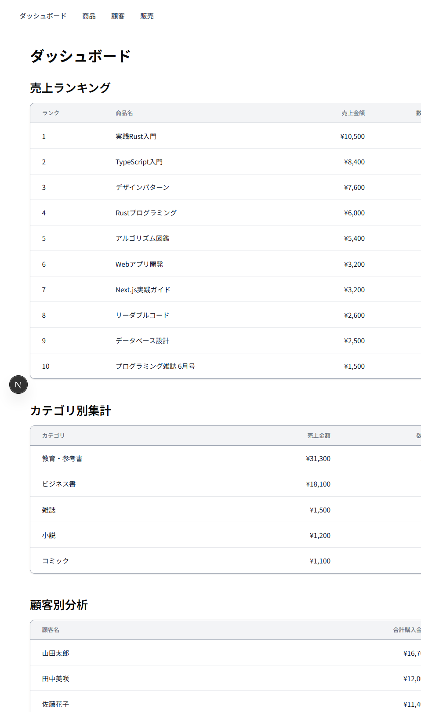
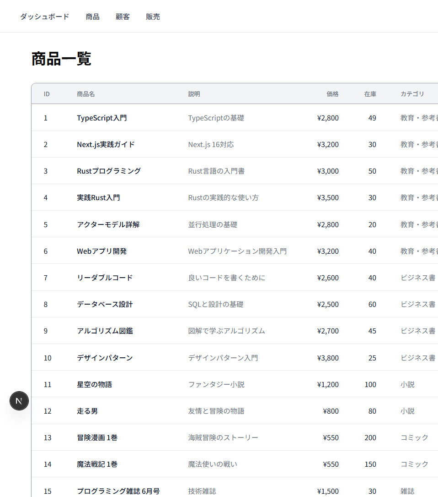
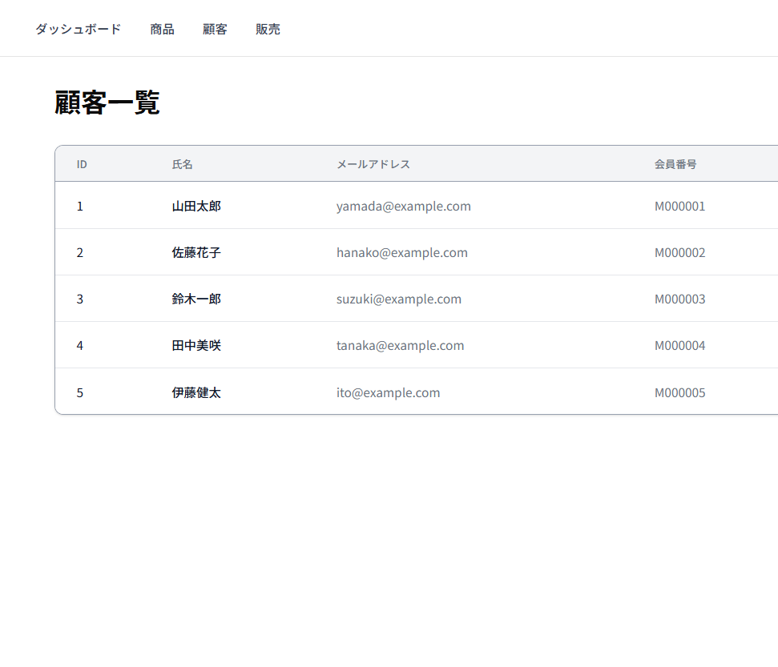
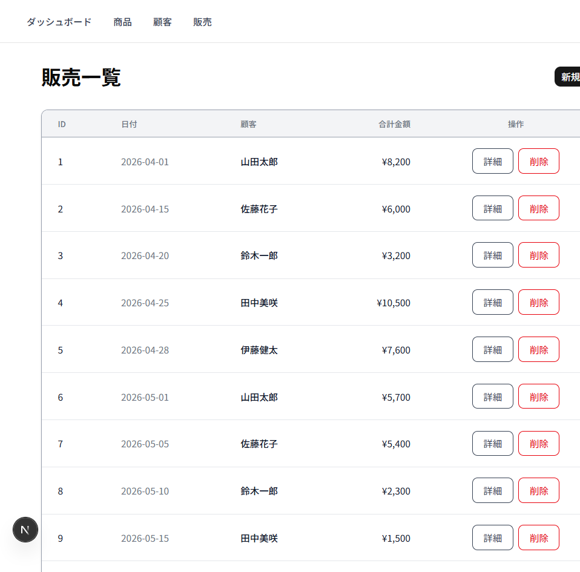
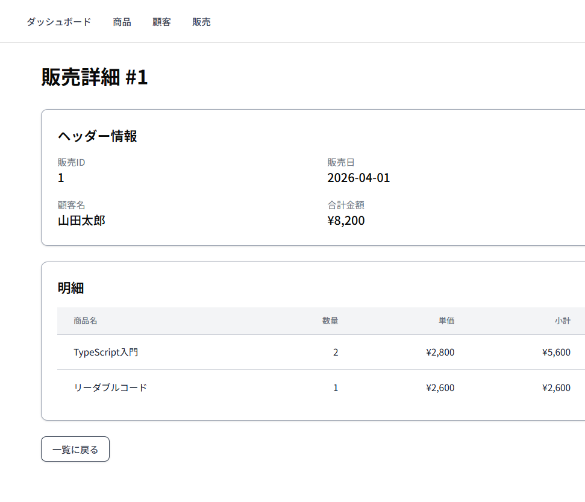
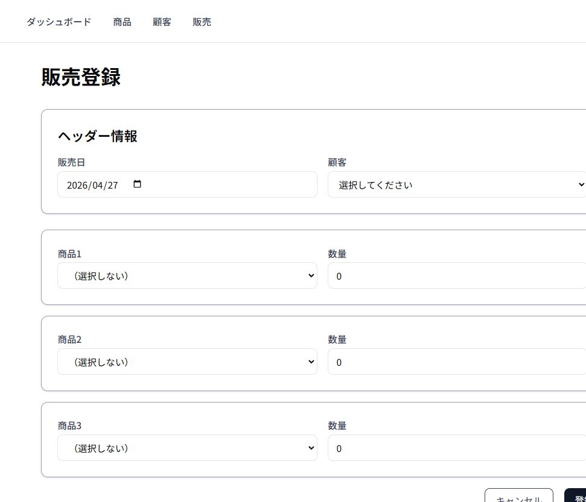

# BookStore - 商品販売データ分析システム (Next.js版)

書籍店舗の商品販売データを収集・分析し、売上状況を可視化するWebアプリケーション。

## 目次

- [概要](#概要)
- [主な機能](#主な機能)
- [技術スタック](#技術スタック)
- [開発環境](#開発環境)
- [アーキテクチャ](#アーキテクチャ)
- [データベース設計](#データベース設計)
- [導入方法](#導入方法)
- [URL設計](#url設計)
- [画面キャプチャ](#画面キャプチャ)
- [開発者向け情報](#開発者向け情報)
- [実装の詳細](#実装の詳細)
- [トラブルシューティング](#トラブルシューティング)
- [セキュリティについて](#セキュリティについて)
- [ライセンス](#ライセンス)

## 概要

小売業の店舗管理者や販売データの分析担当者を対象とした、商品販売データの管理・分析システム。ダッシュボードでの売上可視化、商品・顧客管理、販売データの登録・閲覧機能を提供します。

## 主な機能

| 機能 | 説明 |
|------|------|
| 📊 **ダッシュボード** | 売上ランキング、カテゴリ別集計、顧客別分析を一括表示 |
| 📚 **商品管理** | 商品マスタの閲覧（在庫管理対応） |
| 👥 **顧客管理** | 顧客マスタの閲覧 |
| 💰 **販売管理** | 販売データの登録・閲覧（ヘッダーー明細構造） |

## 技術スタック

| 層 | 技術 | バージョン |
|----|------|-----------|
| 言語 | TypeScript | 5.x |
| フレームワーク | Next.js | 16.2.4 |
| UI フレームワーク | React | 19.2.4 |
| ORM | Drizzle ORM | 0.45.2 |
| DBドライバ | better-sqlite3 | 12.9.0 |
| データベース | SQLite | 3.x |
| UI ライブラリ | shadcn/ui | 4.5.0 |
| CSS | Tailwind CSS | 4.x |

## 開発環境

**開発ツール:**
- **エディタ**: VS Code
- **AIアシスタント**: Claude Code CLI
- **パッケージマネージャー**: npm

**開発プロセス:**
- VS Code でのプロジェクト開発・デバッグ
- Claude Code CLI によるコード生成・レビュー・ドキュメント作成
- Git によるバージョン管理

## アーキテクチャ

### システム構成

```
┌─────────────────────────────────────────────────────────┐
│                      Browser                             │
│                   (React Components)                     │
└────────────────────┬────────────────────────────────────┘
                     │ HTTP Request
                     ▼
┌─────────────────────────────────────────────────────────┐
│                    Next.js App Router                    │
│  ┌──────────┐  ┌──────────┐  ┌──────────┐  ┌─────────┐ │
│  │   page   │  │ products │  │customers │  │  sales  │ │
│  │  index   │  │  _page   │  │  _page   │  │  _page  │ │
│  └──────────┘  └──────────┘  └──────────┘  └─────────┘ │
└────────────────────┬────────────────────────────────────┘
                     │
                     ▼
┌─────────────────────────────────────────────────────────┐
│                     Server Actions                       │
│  ┌──────────┐  ┌──────────┐  ┌──────────┐  ┌─────────┐ │
│  │ Drizzle │  │  Query   │  │  Query   │  │  Query  │ │
│  │  ORM    │  │ Builder  │  │ Builder  │  │ Builder │ │
│  └──────────┘  └──────────┘  └──────────┘  └─────────┘ │
└────────────────────┬────────────────────────────────────┘
                     │
                     ▼
┌─────────────────────────────────────────────────────────┐
│                     SQLite Database                      │
└─────────────────────────────────────────────────────────┘
```

### プロジェクト構成

```
bookstore-nextjs/
├── CLAUDE.md             # プロジェクトノート
├── docs/                 # ドキュメント
├── README.md             # プロジェクト説明
└── nextjs/               # Next.js プロジェクト
    ├── app/              # App Router
    │   ├── (dashboard)/  # ダッシュボードグループ
    │   ├── api/          # API Routes
    │   ├── customers/    # 顧客管理
    │   ├── products/     # 商品管理
    │   └── sales/        # 販売管理
    ├── components/       # Reactコンポーネント
    │   └── ui/          # shadcn/uiコンポーネント
    ├── lib/             # ユーティリティ
    │   └── db.ts       # Drizzleクライアント
    ├── drizzle/        # Drizzle設定
    │   ├── config.ts
    │   └── schema.ts   # DBスキーマ定義
    └── package.json
```

## データベース設計

### ER図

```
┌─────────────┐
│  customers  │ 顧客マスタ
└──────┬──────┘
       │ 1:N
       ▼
┌─────────────┐
│sale_headers │ 販売ヘッダー
└──────┬──────┘
       │ 1:N
       ▼
┌─────────────┐
│    sales    │ 販売明細
└──────┬──────┘
       │ N:1
       ▼
┌─────────────┐           ┌─────────────┐
│  products   │ 商品マスタ │ categories  │ カテゴリマスタ
│             │    N:N    │             │
└─────────────┘──────────▶└─────────────┘
       ▲                           ▲
       │     ┌───────────────┐       │
       └────▶│product_categories│──────▶┘
             │   (中間テーブル)  │
             └──────────────────┘
```

## 導入方法

### 前提条件

- Node.js 20以上（LTS推奨）
- npm

### 手順

```bash
# リポジトリのクローン
git clone <repository-url>
cd bookstore-nextjs

# Next.js プロジェクトのセットアップ
cd nextjs
npm install

# 開発サーバー起動
npm run dev
```

起動後、ブラウザで `http://localhost:3000` にアクセスしてください。

## URL設計

| パス | 説明 |
|------|------|
| `/` | ダッシュボード |
| `/products` | 商品一覧 |
| `/customers` | 顧客一覧 |
| `/sales` | 販売一覧 |
| `/sales/new` | 販売登録フォーム |

## 画面キャプチャ

### ダッシュボード


売上ランキング、カテゴリ別集計、顧客別分析を一覧表示

### 商品管理


商品マスタの一覧表示

### 顧客管理


顧客マスタの一覧表示

### 販売管理


販売データの一覧表示

### 販売詳細


販売データの詳細表示（ヘッダー + 明細）

### 販売登録


新規販売登録フォーム（在庫管理付き）

## 開発者向け情報

### ビルド

```bash
cd nextjs
npm run build
```

### データベースリセット

```bash
# データベースファイルを削除して再シード
cd nextjs
rm bookstore.db
npm run seed
```

### マイグレーション

```bash
# マイグレーション生成
cd nextjs
npx drizzle-kit generate

# マイグレーション適用
npx drizzle-kit push
```

### 依存関係の追加

```bash
# 例: 新しいパッケージを追加する場合
cd nextjs
npm install <package-name>
```

## 実装の詳細

実装手順の詳細は `docs/開発方法.md` を参照してください。

各ステップのドキュメント:
- `docs/Steps/step1.md` - プロジェクト作成
- `docs/Steps/step2.md` - 依存関係追加 (Drizzle, shadcn/ui)
- `docs/Steps/step3.md` - データベーススキーマ定義
- `docs/Steps/step4.md` - マイグレーション + データ初期化
- `docs/Steps/step5.md` - 基本レイアウト (Root Layout + Navigation)
- `docs/Steps/step6.md` - ダッシュボード (ランキング、集計)
- `docs/Steps/step7.md` - 商品管理ページ
- `docs/Steps/step8.md` - 顧客管理ページ
- `docs/Steps/step9.md` - 販売管理ページ (一覧 + 詳細)
- `docs/Steps/step10.md` - 販売登録フォーム (Server Actions + トランザクション)

## トラブルシューティング

### ポート3000が使用中の場合

```bash
# ポートを使用しているプロセスを特定
netstat -ano | grep 3000

# プロセスを終了 (Windows)
taskkill //F //PID <プロセスID>
```

### データベースエラーが発生する場合

```bash
# データベースファイルを削除して再シード
cd nextjs
rm bookstore.db
npm run seed
```

### 依存関係の問題が発生する場合

```bash
# node_modules を削除して再インストール
cd nextjs
rm -rf node_modules
npm install
```

## セキュリティについて

⚠️ **本アプリは学習・開発目的であり、本番運用を想定していません。**

このプロジェクトは以下の点で本番環境向けの構成ではありません：

- **認証・認可機能**: 実装されていません
- **SQLインジェクション対策**: Drizzle ORMによるパラメータバインドを使用していますが、追加の検証が必要です
- **HTTPS対応**: HTTPのみの通信です
- **セッション管理**: 実装されていません
- **入力検証**: 基本的な検証のみ実装されています
- **アクセス制御**: 実装されていません

本番環境での使用については、追加のセキュリティ対策を実装してください。

## ライセンス

MIT License
